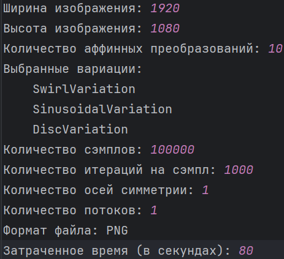
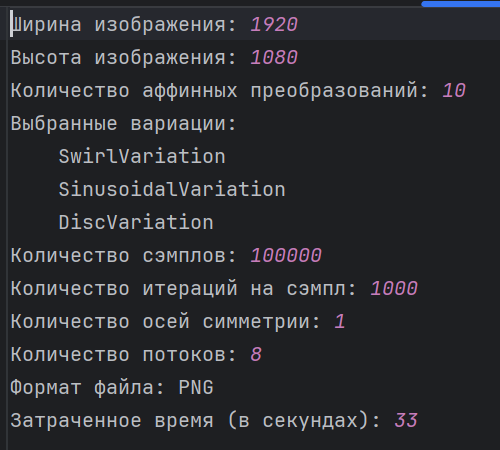
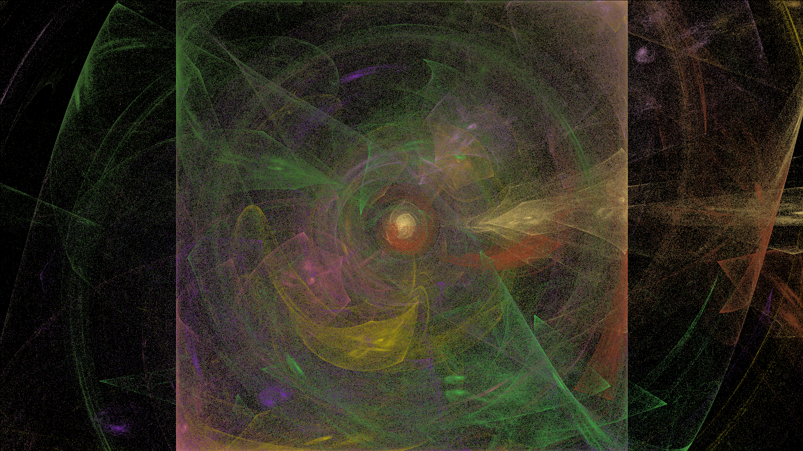
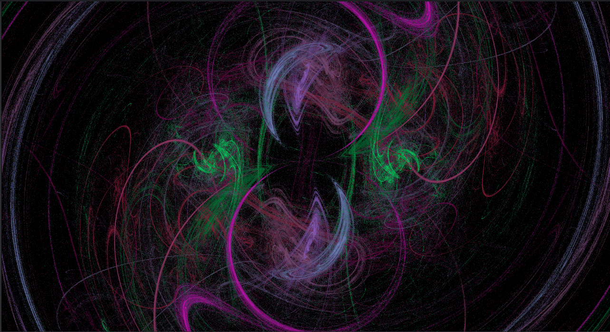
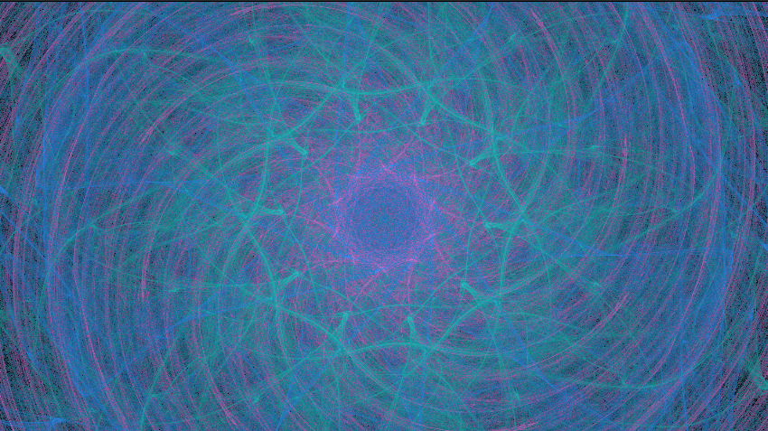

# Проект №4. Фрактальное пламя

Приложение позволяет генерировать изображения фрактального пламени на основе Chaos game.
Доступна как однопоточная версия, так и многопоточная реализация рендеринга изображений.

## Инструкция по использованию интерфейса командной строки

В данном проекте для получения от пользователя входных параметров
генерируемого фрактального изображения используется интерфейс командной строки.
Здесь дано краткое описание флагов и возможных значений
***

### Размеры изображения

Для задания **ширины** используются флаги ``--image-width`` или ``-w`` \
Для задания **высоты** используются флаги ``--image-height`` или ``-h``
***

### Количество аффинных преобразований

***(Необязятельный параметр)***
Для задания **количества аффинных преобразований** используются флаги ``--affines-number`` или ``-a``
***

### Выбор нелинейных преобразований (вариаций)

Для задания **нелинейных преобразований** используются флаги ``--variation``, или ``--variations``, или ``-v``\
После указания флага следует без пробелов через запятую записать названия вариаций\
**Список доступных вариаций**:

* Handkerchief
* Sinusoidal
* Spherical
* Swirl
* Disc
* Bent

***

### Выбор количества сэмплов и итераций

Для задания **количества сэмплов** используются флаги ``--samples-number`` или ``-samples`` \
Для задания **количества итераций** используются флаги ``--iter-per-sample`` или ``-iter``
***

### Выбор количества осей симметрии
***(Необязательный параметр)***
Для выбора количества **осей симметрии** используются флаги ``--symmetry-axes-number`` или ``-symmetry``
***

### Выбор режима работы (однопоточный/многопоточный)
**Использование одновременно двух режимов не допускается!**\
Для выбора **однопоточного режима** следует задать флаг ``--one-thread``, который **не требует** после себя какого-либо
значения\
Для выбора **многопоточного режима** следует задать флаг ``--multi-threads``, после которого **требуется** задать количество
потоков

## Сравнение результатов работы приложения в однопоточном и многопоточном режиме

Для анализа работы приложения в двух режимах определим следующую конфигурацию:

* Ширина изображения: 1920
* Высота изображения: 1080
* Количество аффинных преобразований: 10
* Выбранные вариации:
    * Swirl
    * Sinusoidal
    * Disc
* Количество сэмплов: 100000
* Количество итераций на сэмпл: 1000
* Количество осей симметрии: 1
* Формат файла: PNG

***

### Однопоточный режим

В однопоточном режиме приложение сгенерировало изображение и лог файл:
***
**Изображение**

***
**Лог-файл**

***
В результате на генерацию ушло **80 секунд**

### Многопоточный режим (8 потоков)

В многопоточном режиме приложение сгенерировало изображение и лог-файл
***
**Изображение**

***
**Лог-файл**

***
В результате на генерацию ушло **33 секунды**

***

***В результате сравнения скорость работы приложения в многопоточном режиме почти в 2.5 раза выше чем при использовании
однопоточного режима***

## Примеры сгенерированных изображений

