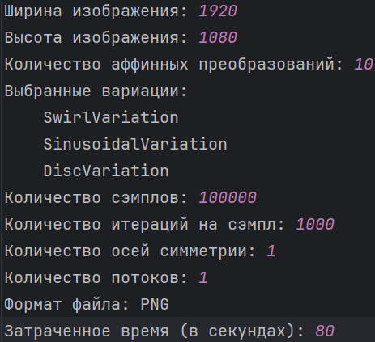
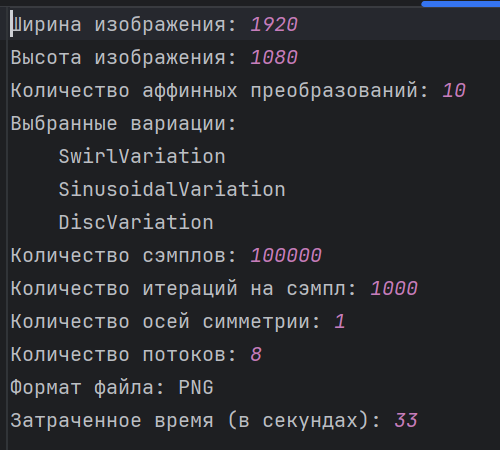

# Сравнение результатов работы приложения в однопоточном и многопоточном режиме

Для анализа работы приложения в двух режимах определим следующую конфигурацию:

* Ширина изображения: 1920
* Высота изображения: 1080
* Количество аффинных преобразований: 10
* Выбранные вариации:
    * Swirl
    * Sinusoidal
    * Disc
* Количество сэмплов: 100000
* Количество итераций на сэмпл: 1000
* Количество осей симметрии: 1
* Формат файла: PNG

***

## Однопоточный режим

В однопоточном режиме приложение сгенерировало изображение и лог файл:
***
**Изображение**

***
**Лог-файл**

***
В результате на генерацию ушло **80 секунд**

## Многопоточный режим (8 потоков)

В многопоточном режиме приложение сгенерировало изображение и лог-файл
***
**Изображение**

***
**Лог-файл**

***
В результате на генерацию ушло **33 секунды**

***

***В результате сравнения скорость работы приложения в многопоточном режиме почти в 2.5 раза выше чем при использовании
однопоточного режима***
